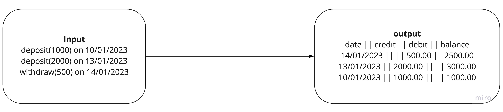
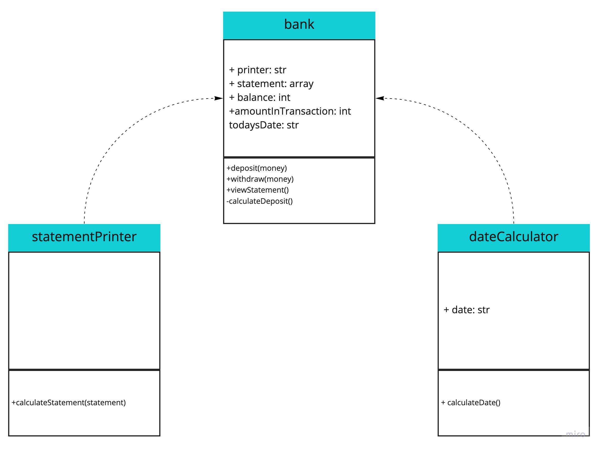

## Bank With Javascript
```
                      (@#                                              
              @@@@@@@@@@@@@@@@@                                       
            @@@@@@@@@@@@@@@@@@@@@@@                                    
          @@@@@@@@@@@@@@@@@@@@@@@@@@@                                  
        @@@@@@@@@@@       @@@@@@@@@@@                                 
        @@@@@@@@@@           @@@@@@@@@@                                
        @@@@@@@@@              @@@@@@*                                 
        @@@@@@@@@                                                      
        @@@@@@@@@                                                     
        #@@@@@@@@%                                                    
  @@@@@@@@@@@@@@@@@@@@@@@@@@@@@@@@@@                                   
  @@@@@@@@@@@@@@@@@@@@@@@@@@@@@@@@@@@                                  
  @@@@@@@@@@@@@@@@@@@@@@@@@@@@@@@@@@@                                  
  @@@@@@@@@@@@@@@@@@@@@@@@@@@@@@@@@                                   
            @@@@@@@@@                                                  
            .@@@@@@@@                                                  
            @@@@@@@@@                                                  
          @@@@@@@@@@                                                   
        @@@@@@@@@@@                                                    
    (@@@@@@@@@@@@@@@@@@@@@@@@%     @@@                                 
  @@@@@@@@@@@@@@@@@@@@@@@@@@@@@@@@@@@@@                                
  @@@@@@@@@@@@@@@@@@@@@@@@@@@@@@@@@@@@@@                              
    @@@@@/             .@@@@@@@@@@@@@@ 
```
### This program is designed to emulate a bank statement. The functionality is as follows:

* View your statement - formatted with a header at the top, with the most recent transactions first.
* Deposit money.
* Withdraw money.

This system was built using the following [TDD](https://en.wikipedia.org/wiki/Test-driven_development#:~:text=Test%2Ddriven%20development%20(TDD),software%20against%20all%20test%20cases.). (Jest)

## Installation
Fork or download this repo.
Use `npm install` to install the correct dependancies to use and test this code. You can require the code from terminal, or copy & paste it in Node.

## My Approach

### Input & Output Table
I initially made an input / output table to get an understanding of what the result of the code should look like.=:


### UML Class Diagram
I also created a UML Class Diagram. This program would be split into three classes that handle different responsibilities:
1. `bank` - The main class. This will be responsible for depositing, withdrawing and printing the statement.
2. `dateCalculator` - This class essentially formats the date into a `dd/mm/yyyy` format to be used. Dependency injected into `bank`.
3. `statementPrinter` - This class formats the statement, whilst being loosely coupled. Dependancy injected into `bank`.



## How To Use
Make a new instance of bank with `const bank = new bankApp();`.

Call `.deposit(x)` to deposit `x` money into your bank account.
Call `.withdraw(x)` to withdraw `x` money into your bank account.
Call `.viewStatement()` to show your bank statement.

## An Example Of Usage
1. Run Node:

2. Setup the project with the following code:

3. Make a new deposit:

4. Make a withdrawal:

5. If you make a withdrawal for an amount greater than your balance, you will receive a message:

6. View your statement:


## How To Test
Run `jest` to run through tests.

## Future features // Edge cases
* Protection is built in against withdrawing an amount that is greater than the balance.

